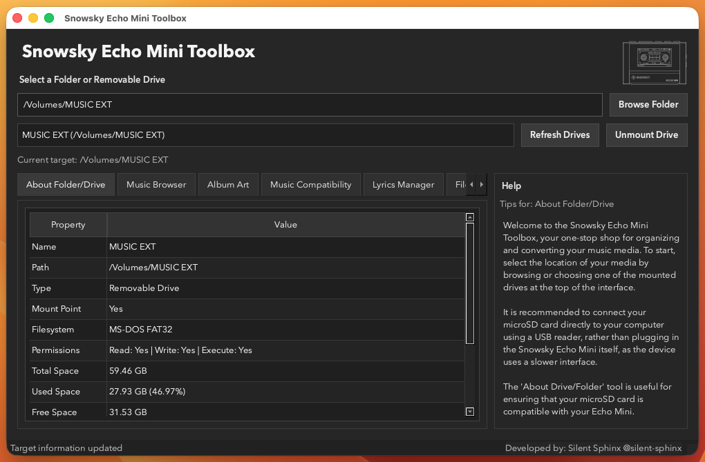

# Snowsky Echo Mini Toolbox

[](https://www.python.org/)
[](#requirements)
[](https://doc.qt.io/qtforpython-6/)


An easy (unofficial) desktop app to prepare your music folders and USB drives for the Snowsky Echo Mini.



The Snowsky Echo Mini is a fantastic little device, but its affordable hardware can sometimes limit compatibility and available features. This tool aims to remove the hassle of getting your music ready to play by automatically identifying incompatible media and converting it to a supported format. It can also fix album artwork and download lyrics, giving you everything you need to enjoy your music without the usual compatibility headaches.

<!-- TOC -->

- [Snowsky Echo Mini Toolbox](#snowsky-echo-mini-toolbox)
    - [Table of Contents](#table-of-contents)
    - [Main Features](#main-features)
    - [Please Backup Your Data](#please-backup-your-data)
    - [Installation](#installation)
        - [Required Dependencies Linux Only](#required-dependencies-linux-only)
        - [Supported Operating Systems](#supported-operating-systems)
            - [Notice for Windows Users](#notice-for-windows-users)
                - [Setup Instructions](#setup-instructions)
    - [Build from source](#build-from-source)
    - [Compatibility Rules](#compatibility-rules)
    - [Contributing](#contributing)
    - [Troubleshooting](#troubleshooting)
        - [macOS App Fails to Open Stuck Bouncing in Dock](#macos-app-fails-to-open-stuck-bouncing-in-dock)

<!-- /TOC -->

## Main Features

- **Music Compatibility**:
  - Identify incompatible media and auto-fix.
- **Album Art**:
  - Identify incompatible album art and auto-fix.
  - Download new album art via the MusicBrainz API and Cover Art Archive.
- **Lyrics Manager**:
  - Identify embedded lyrics and convert them to compatible `.lrc` files.
  - Download new lyrics via LRCLIB bulk lookup.
- **Metadata Manager**:
  - Edit audio tags and properties in bulk.
- **File Rename**:
  - Suggest cleaner file names from metadata before applying changes.
- **File Cleanup**:
  - Group files by type so you can safely remove unwanted categories.
- **Backup & Restore**:
  - Create ZIP backups, or copy/move your library to another location.

## Please Backup Your Data

- This program will directly edit music files on your selected device. This can result in unintended data loss, it is always RECOMMENDED to use the backup tools provided to ensure you have a second copy of your data in-case of failure.

## Installation

Locate the Releases page for this project and select the correct installation file for your system architecture.

### Required Dependencies (Linux Only)

```bash
sudo apt-get update && sudo apt-get install -y ffmpeg libxkbcommon-x11-0 libxcb-cursor0 libxcb-icccm4 libxcb-image0 libxcb-keysyms1 libxcb-render-util0 libxcb-xkb1
```

### Supported Operating Systems

The following operating systems & architectures are offically supported.

| Operating System | Architecture | Format |
| ---- | ---- | ---- |
| Windows | 64-bit | Installation (.exe) |
| Linux   | - | .tar.gz & .deb |
| MacOS | ARM64 (Apple Silicon) | .dmg |
| MacOS | x64 Intel | .dmg |

#### Notice for Windows Users

Unfortunately, Windows Smart App Control blocks executables from small developers with no user override. Disabling SAC is not recommended, so whilst the `.exe` remains available, it is strongly recommended to clone the repository and run the program via Python directly.

##### Setup Instructions

1. Install ffmpeg via winget: `winget install -e --id Gyan.FFmpeg`
   — or download it manually from https://github.com/BtbN/FFmpeg-Builds/releases
2. Ensure Python 3.12 is installed
3. Clone the repository: `git clone https://github.com/silent-sphinx/snowsky-echo-mini-toolbox.git`
   — or download the `.zip` from the GitHub page
4. Create a virtual environment and run the program:

```bash
py -3.12 -m venv venv
.\venv\Scripts\Activate.ps1
pip install -r requirements.txt
.\venv\Scripts\python main.py
```

We apologise for the inconvenience. Microsoft's increasing restrictions on unsigned executables make it genuinely difficult to distribute small community tools easily, and we're actively looking into longer-term solutions.

## Build from source

This project is developed in Python 3.12+, and using Python 3.12 is recommended.

Note: If `pip install -r requirements.txt` fails, ensure your active Python interpreter is
Python 3.12. On Windows, the Python launcher can help (e.g. `py -3.12 -m venv venv`).

1. Ensure that ffmpeg is installed (for ffmpeg/ffprobe)
2. Clone the repository.
3. Create and activate a virtual environment.
4. Install dependencies.

macOS and Linux:

```bash
python3 -m venv venv
source venv/bin/activate
pip install -r requirements.txt
```

Windows PowerShell:

```powershell
py -3.12 -m venv venv
.\venv\Scripts\Activate.ps1
pip install -r requirements.txt
```

Start the app:

```bash
python3 main.py
```

Start with a pre-selected target path:

```bash
python3 main.py --path /path/to/folder-or-drive
```

## Compatibility Rules

Full technical rules are in [COMPATIBILITY.md](COMPATIBILITY.md).

## Contributing

Contributions are welcome.

Basic flow:

1. Open an issue describing the change or bug.
2. Create a focused branch.
3. Keep pull requests small and include test or validation steps.
4. Update documentation when behavior changes.

If you add a new tab or workflow, include:

- What users will see and do
- How errors are handled
- Any dependency or platform notes

## Troubleshooting

### macOS App Fails to Open (Stuck Bouncing in Dock)

If you download the macOS `.dmg` release from GitHub, you might find that the application icon bounces in the Dock indefinitely and never opens the main window. This is caused by macOS Gatekeeper blocking the execution of unsigned developer builds.

To resolve this issue:

1. **Delete any old version first:** If you are upgrading from a previous release, do **not** simply drag-and-replace (overwrite) the app. Drag the old `Snowsky Echo Mini Toolbox.app` from your `/Applications` folder to the Trash first to avoid macOS path-level cache conflicts.
2. **Clear the quarantine flag on the installer:** Before mounting the DMG, open your Terminal and run the following command to remove the macOS quarantine attribute from the downloaded DMG file:
   ```bash
   xattr -cr ~/Downloads/snowsky-echo-mini-toolbox-dev-macOS-arm64.dmg
   ```
   *(If your downloaded file has a different name, make sure to adjust the filename in the command).*
3. **Mount and Install:** Double-click the cleared `.dmg` to mount it, and drag `Snowsky Echo Mini Toolbox.app` into `/Applications`.
4. **Open the App:** It should now open immediately!
